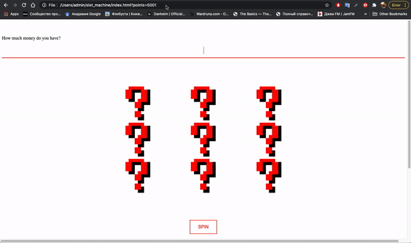
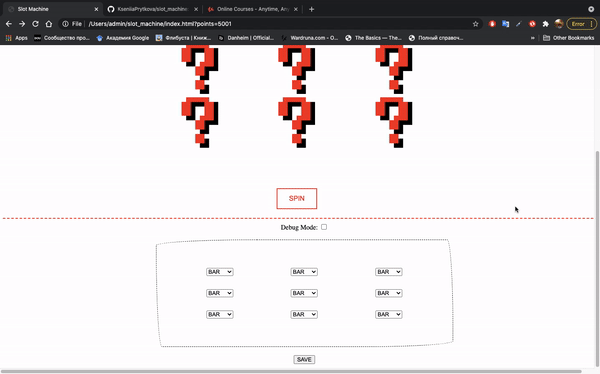

# slot_machine
## Run:
1. `>git clone https://github.com/KseniiaPrytkova/slot_machine.git` or just download the project;
2. `>open index.html` or open `index.html` file in any other way;
3. `>git pull` to check for updates.

## Preview:
### slot machine itself:
- Enter a valid number in input field (range is [1...5000]). That's is initial amount of points program will deal with.
- Click **SPIN** button.
- When the number of win points reaches 5000, the game will stop (to avoid infinity).
- When you lose all points, the game, oddly enough, also stops.

### debug mode:
- Select the corresponding checkbox.
- Choose the desired combination of symbols for each reel.
- Click **SAVE** button!
- Click **SPIN** button.

## Short description of the logic:
1. When **SPIN** button was clicked `startSlotMachine()` function is called. Initial function, that calls
`spinSlotMachine()` function (performs animation), waits untill animation is finished to start calculate payouts by calling `isPayouts()` function.
2. `spinSlotMachine()`: looping throught the table with id `slotsCollection` which represents the slot machine. For each table cell (for each element of the slot machine) the function  `spinEachTableCell()` is called.
3. `spinEachTableCell()`: this function implements the logic of choosing an image for each element of the slot machine, as well as the logic of animation. The available variants of the images that may appear on the reels stored in the `arr` array. The function repeatingly selects a picture from an array of images by generating a random number, which is the index of the `arr` array element. Next, the function determines that it is time to stop the rotation and saves the value (namely, its index) of the last appeared `arr` array element in the resulting `resultArr` array, which will be needed for the next function `isPayouts()` to decide on winning combinations.
4. `isPayouts()`: all winning combinations are stored in an array of objects `data` in `winCombinations.js` file. The function in the loop compares each horizontal slot of the machine (there are 3 of them) with each potentially winning combination. Two parameters are taken into account - the number of line `line` and the combination itself `sequence`. The function returns number of points earned or, respectively, zero if no winning combinations were found.
5. in **debug mode** function `isPayouts()` deals with `debugArr` instead of `resultArr`. Array `debugArr` drawn up in `startDebugMode()` function in `debugMode.js` file based on user choices in `debugTable`. `startDebugMode()` function will be called when user clicks **SAVE** button.

## TODO:
- ~~add more winning combinations;~~ [**DONE** - can be optimised]
- ~~change div on text fild;~~ [**DONE**]
- ~~ask user for initial amount of money, display that in text field;~~ [**DONE**]
- ~~deal with out of money (just negative values for now);~~ [**DONE**]
- ~~add blinking to the text field when win combination happens;~~ [**DONE**]
- make win event nicer then changing background by id;
- style the game table itself;
- ~~add debug area;~~ [**DONE**]
- ~~add corresponding logic for debug area;~~ [**DONE**]
- ~~if more then 1 row won, then only 1 is highligted (bug for now);~~ [**DONE**]
- improve combinatorics logic;
- ~~remove unnecessary classes/ids;~~ [**DONE** - for now]
- ~~check variables names, change let on const if can be done;~~ [**DONE** - for now]
- fix(check) time logic (spinning must last 2 seconds, after that reels start to sop one by one (starting from left) having 0.5 sec delay between landings);
- ~~think about how game ends (max value);~~ [**DONE**]
- ~~describe logic in readme;~~ [**DONE**]
- ~~fix double quotes/ single quotes;~~ [**DONE**]
- think over more possible errors, cover them;
- test logic, find bugs. [**CAN'T NEVER BE DONE**]
